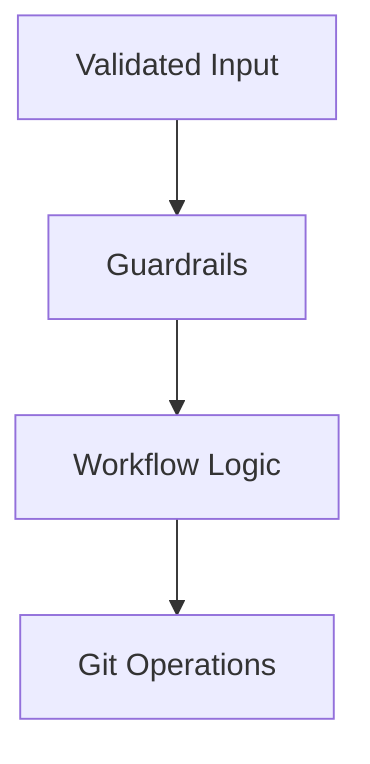
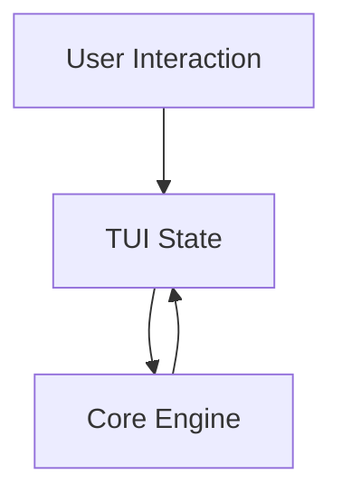
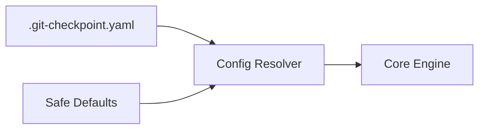
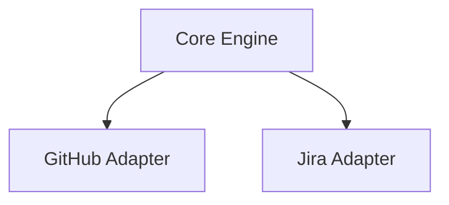
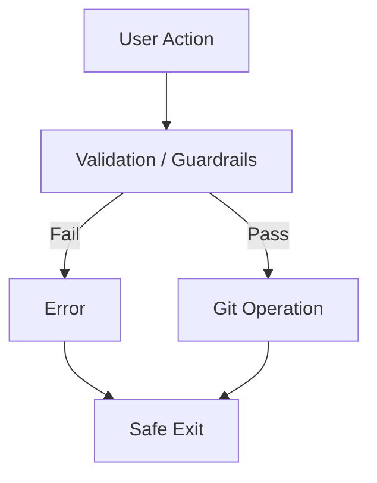
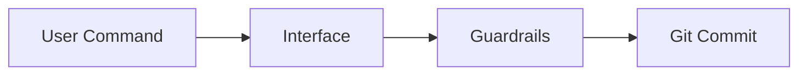
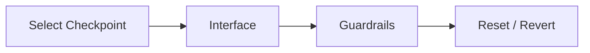

# Architecture

This document describes the architecture of git-checkpoint.

The system is designed to provide a single, consistent checkpoint-driven workflow
while supporting multiple interfaces and enforcing safety guardrails.

---

## Architectural goals

- Preserve Git as the source of truth
- Centralize workflow and safety logic
- Support multiple user interfaces
- Enforce guardrails consistently
- Allow incremental evolution without breaking workflows

---

## High-level overview

git-checkpoint is structured as a layered system.

```mermaid
flowchart TB
    Interfaces["Interfaces<br/>- Git Aliases<br/>- Shell Commands<br/>- CLI<br/>- TUI"]
    Core["Core Engine<br/>- Workflow Logic<br/>- Guardrails<br/>- Git Operations"]
    Git["Git"]

    Interfaces --> Core --> Git
````

All interfaces delegate behavior to the same core logic.

---

## Core concepts

### Checkpoint

A checkpoint is a Git commit that represents a temporary safety state.

Properties:

* Identified by a configurable commit message prefix
* Cheap to create and discard
* Not intended as permanent project history

Checkpoints are treated as workflow artifacts, not final decisions.

---

### Guardrails

Guardrails are enforced rules that prevent destructive or unsafe operations.

They:

* Protect branches and paths
* Require explicit user intent for destructive actions
* Apply consistently across all interfaces

Guardrails are enforced by the core engine before any Git mutation.

---

### Rollback

Rollback is an explicit operation that restores a previous state.

Supported strategies:

* Hard reset
* Revert commit

The strategy is determined by:

* Branch protection rules
* Configuration
* Explicit user choice

---

## Component layers

### Interfaces layer

The interfaces layer provides multiple ways to interact with the same workflow.

```mermaid
flowchart LR
    Alias["Git Aliases"]
    Shell["Shell Commands"]
    CLI["CLI"]
    TUI["TUI"]

    Alias --> Core
    Shell --> Core
    CLI --> Core
    TUI --> Core
```

Responsibilities:

* Collect user intent
* Present information
* Delegate execution

Interfaces must not:

* Implement business logic
* Bypass guardrails
* Perform Git operations directly

---

### Core engine

The core engine contains all workflow logic.



Responsibilities:

* Validate commands and configuration
* Enforce guardrails
* Execute Git operations
* Report results and errors

The core engine must:

* Be deterministic
* Fail safely
* Never leave the repository in an intermediate state

---

### Shell-based implementation

The shell implementation is the initial concrete realization of the core engine.

Purpose:

* Reference implementation
* Early usability
* Canonical behavior definition

Constraints:

* Minimal dependencies
* Explicit command execution
* Clear error handling

---

### Standalone CLI

The standalone CLI replaces the shell implementation in later phases.

Responsibilities:

* Argument parsing
* Structured output
* Configuration validation
* CI-friendly execution

The CLI must behave identically to the shell implementation.

---

### Terminal UI (TUI)

The TUI provides an interactive interface on top of the core engine.



Responsibilities:

* Visualize state
* Enable navigation
* Require confirmation for destructive actions

The TUI must not:

* Perform implicit operations
* Bypass guardrails
* Modify Git state without confirmation

---

## Configuration flow

Configuration is resolved once per invocation and passed to the core engine.



Configuration may influence behavior but must not weaken safety guarantees.

---

## Integration adapters

Integrations are implemented as optional adapters.



Rules:

* Integrations are optional
* Feature-detected, not required
* Must fail gracefully
* Must never bypass guardrails

---

## Error handling model

Error handling is consistent across all layers.



On failure:

* No partial changes remain
* Repository remains valid
* Error messages are explicit and actionable

---

## Data flow examples

### Checkpoint creation



---

### Rollback



---

## Extensibility model

The architecture supports extension by:

* Adding new commands to the core engine
* Adding optional integration adapters
* Extending configuration schema
* Enhancing TUI presentation

Extensions must not:

* Fragment behavior
* Introduce hidden automation
* Compromise safety

---

## Non-goals (architectural)

* Background services or daemons
* Automatic decision-making
* Replacing Git internals
* GUI applications

